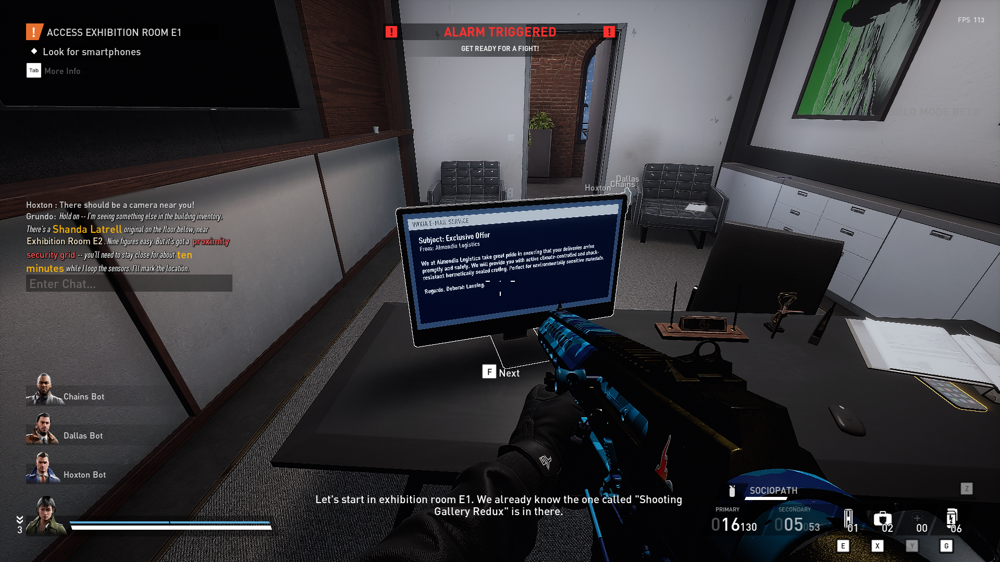
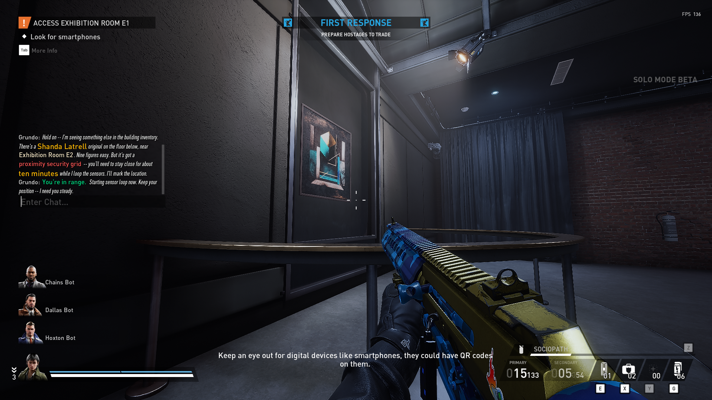
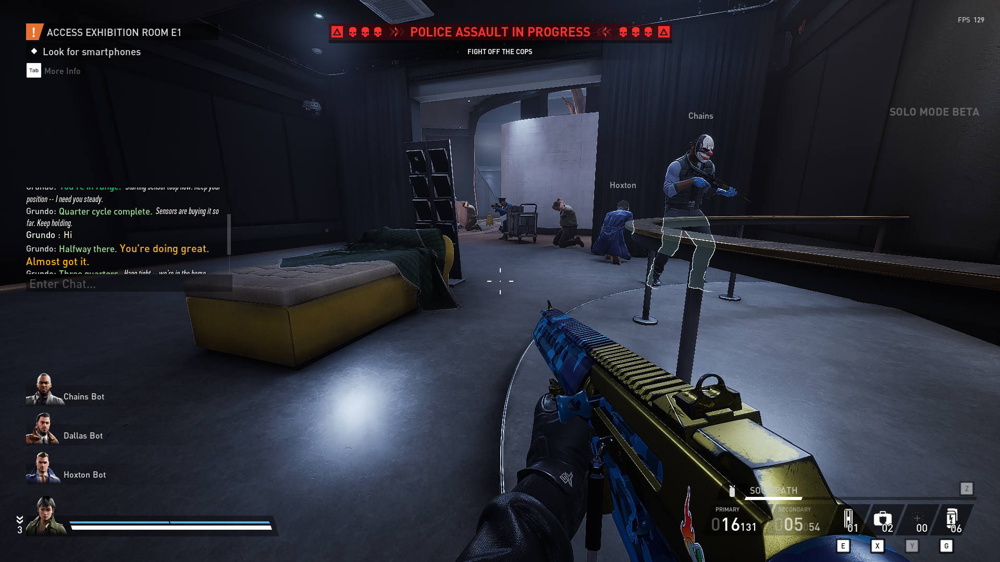
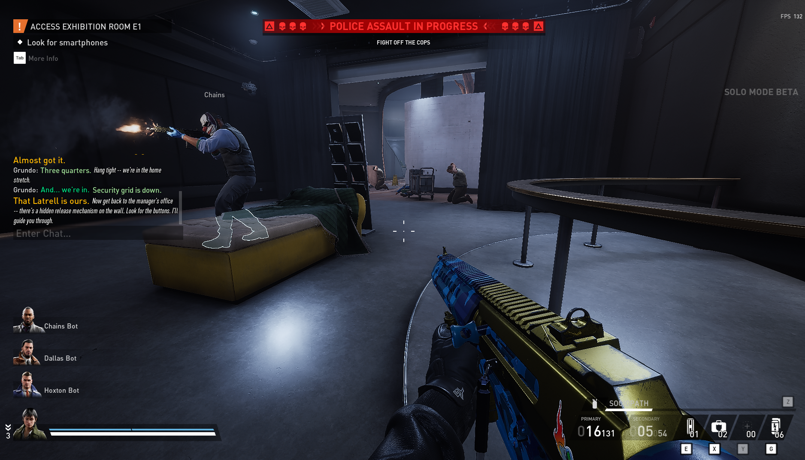
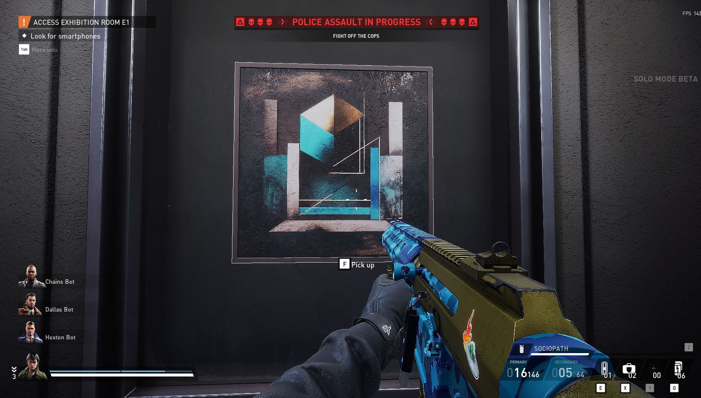
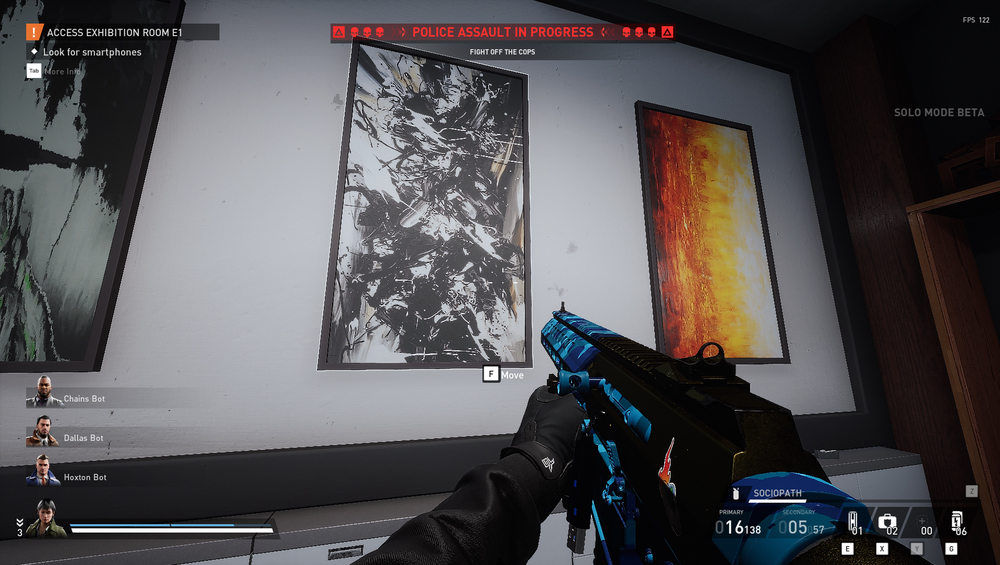
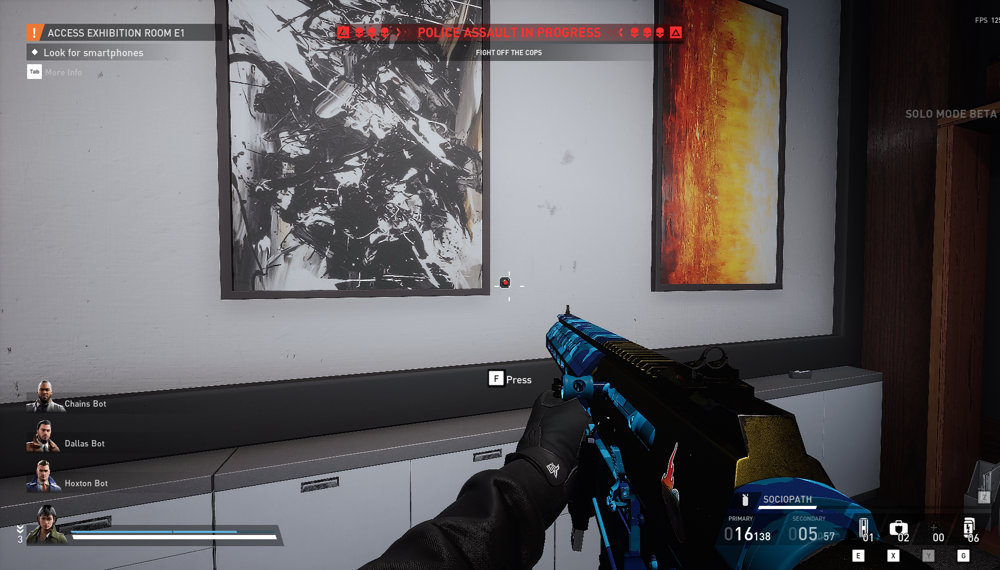

# EnableHiddenPainting

This mod lets you unlock the hidden painting on Art Gallery in loud, making the "True Connoisseur" achievement obtainable in solo play.

## How it works

1. Complete the hack in the manager's office
2. Your contact spots a rare Shanda Latrell painting on the floor below, near Exhibition Room E2
3. Go to the painting and defend your position for 10 minutes while the security grid is bypassed
4. You'll receive chat updates at 25%, 50%, and 75% progress
5. Once complete, return to the manager's office to find the hidden release mechanism

<details>
<summary>Screenshots</summary>















</details>

## Setup

This is a lua mod and not a pak mod. You need [UE4SS](https://modworkshop.net/mod/47771).

1. Install UE4SS into your PAYDAY 3 directory
2. Place the mod so the file structure looks like:
   ```
   steamapps\common\PAYDAY3\PAYDAY3\Binaries\Win64\UE4SS\Mods\EnableHiddenPainting\scripts\main.lua
   ```
3. Open `PAYDAY3\PAYDAY3\Binaries\Win64\UE4SS\Mods\mods.txt` and add `EnableHiddenPainting : 1` at the bottom:
   ```
   BPML_GenericFunctions : 1
   AllowModsMod : 1

   ; Built-in keybinds, do not move up!
   Keybinds : 1

   EnableHiddenPainting : 1
   ```

## Notes

- Chat messages guide you through each step
- The defense timer only counts while you're near the painting
- Timer pauses if you leave the area and resumes when you return
- Tested in solo loud only, no idea whether works in multiplayer.

## Config

Defense duration, zone size, and logging can be adjusted at the top of the script file.

---

This is my first UE mod ever, so don't hate it! I hope you enjoy it. I'm looking forward to improving it as I get to know Unreal Engine better.
